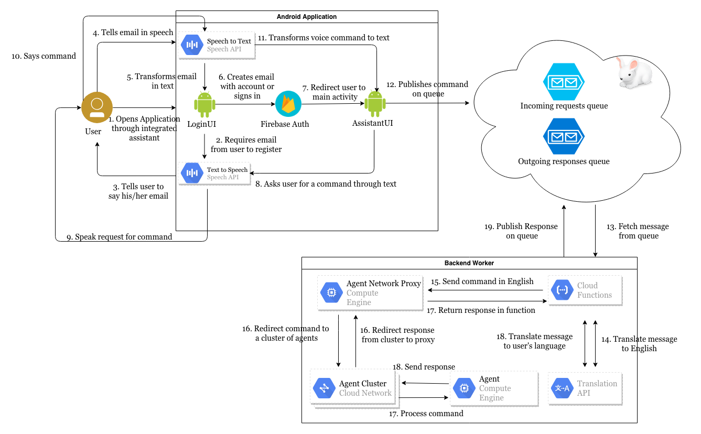
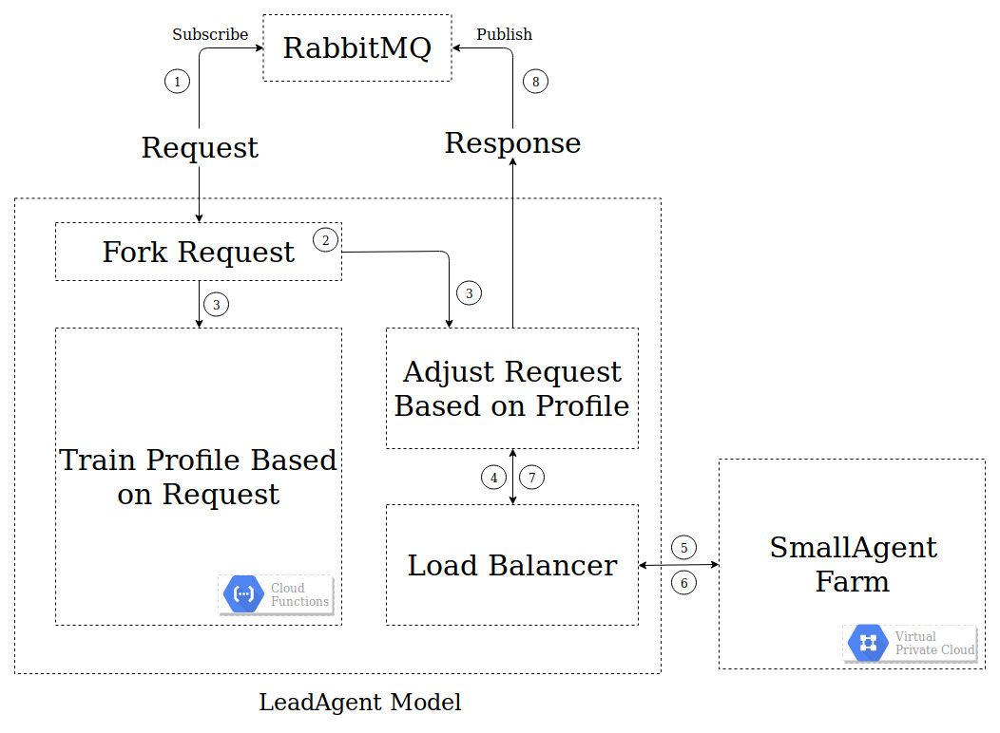
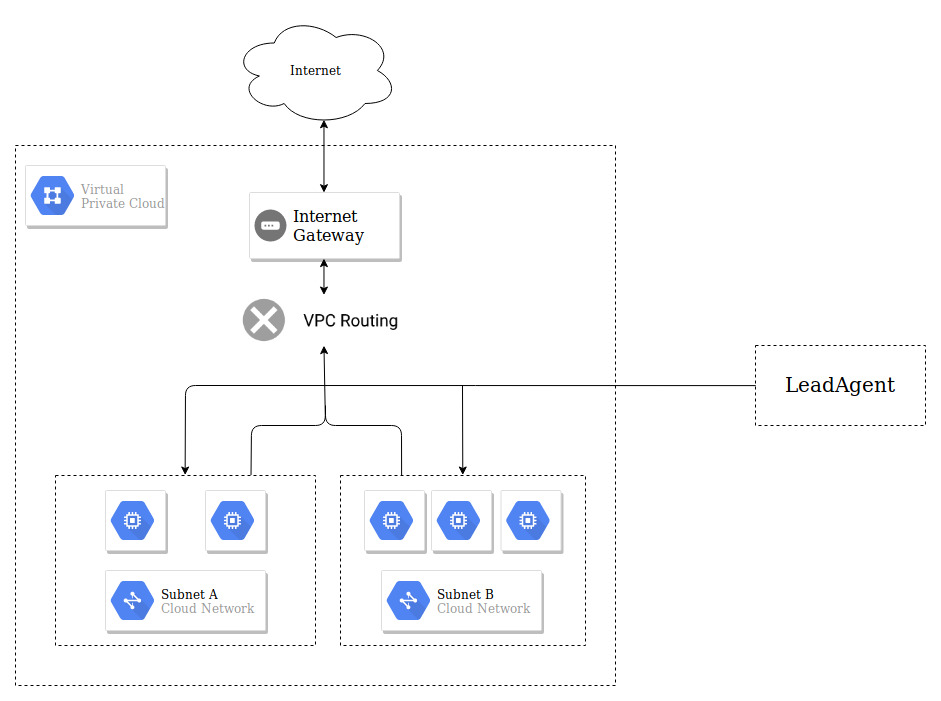

# Risk Assesment

The application will be dived in a three slice model in which the main components are:

- User Slice
- Transport Slice
- AgentFarm Slice

The main purpose of this type of arhitecture is to achieve separation of concern and modularity/independecy.

## Application Requirements

The application must **take the input** of the user with visual impariment and respond **accurately** to the request in an **user friendly** manner.

## User Slice

## User Slice Requirements Identification

This slice must take the input of the user with visual impariment, which is **_an audio request_**[1] through **_integrated assistant_**[2] using a set of functionalities that **_pass a vocal command to smart agent(s)_**[2] that responds with a **_vocal command in the same language_**[1].

- [1] - user friendly
- [2] - take the input

Observations:

- to provide a more user friendly experience to the user the vocal response functinoality requires a synthesizer (+)
- smart agents don't support every language so a languange identifier and translation would be beneficial in order to serve a better experience (+)
- taking the input doesn't only refer to just receive the request, but to consume it in order to produce a result (?)

## Understanding User Slice

The main purpose of this **slice** is to handle user requests at Android level.

Main actors:

- ***user***
- ***android application***

Secondary actors:

- ***Google Cloud Platform services***
  - **Speech API** (Speech to Text and Text to Speech)
- ***Firebase***

## User Flow

The ***user*** open the ***iAssitMe application*** through integrated assistant in order
to give a voice command. The ***LoginUI*** class authenticates the user vocally (email, password)
using the **Speech to Text API** provided by ***GCP***. If the account associated to the user exists and the credentials
verify the user is authenticated, else if the credentials do not verify the user is audio prompted to
"re-enter" the credentials, else the user is audio prompted to create an account using audio commands.
This authentication phase is done via ***Firebase Auth***. The audio prompts are realized via the **Text to Speech API**.

Once the **user** is authenticated, audio request are passed to the **application** by speech to text conversions,
while the **application** return audio responds by text to speech conversion. The conversion is realized by using **GCP services**.

## User Slice Diagram

## User Slice Risks

- this slice requires Android programming knowledge, if the developers with this knowledge are unavailable the developement process will have setbacks
- users with less capable phones might not support this application due to integrated agent versions
- how is the user authorized in a secure way?

## Transport Slice

## Transport Slice Requirements Identification

This slice must **transport** the user request to a smart agent in order to receive an **accurate response**.

Observations:

- in order to improve the accuracy of the response, the request needs to adjusted based on the user current profile (e.g: add recent fields of interest) (+)
- for the request to be adjusted properly, the user profile needs to go undergo training after every request (+)
- in order to avoid bottlenecks, a load balancer is needed (+)

## Understanding Transport Slice

The main purpose of this **slice** is to transport the request from the user front-end to the back-end.

## Transport Flow

After the application receives the user request it then sends the request to a message broker (in this case **RabbitMQ**). **The LeadAgent** subscribes to the **RMQ** and it forks the request for two main purposes:

- send the request to a train function to increase the improve the user profile
- adjust the request and send it to the smart agent(s)

After the adjustment the request is passed on the smart agent(s) via a load balancer in order to **avoid bottlenecks**.

## Transport Slice Diagram

## Transport Slice Risks

- one LeadAgent might underperform if the number of requests is too high
- single point of failure if safety mecanism is not implemented

## AgentFarm Slice

## AgentFarm Slice Requirements Identification

This slice is responsible of consuming the **user request** that was **transported** between this slice and the ***user slice*** an provide an **accurate response**.

Observations:

- the request needs to be interpreted; extract the keywords and provide a result based on the user profile
- the response time must be optimal
- the accuracy of the response is based on the **"cleverness"** of the smart agents

## Understanding AgentFarm Slice

The main purpose of this **slice** is to provide a set of smart agents that is able to provide **accurate** responses based on **user profile**. The ***AgentFarm*** is stored inside a **GPC VPC** where multiple **compute nodes** host smart agents that share a non relational database about user profiles (read only on this level).

## AgentFarm Flow

The **load balancer** "balances" the request to one of the multiple SmallAgents in the farm in order to receive an resposne. The SmallAgent receives the adjusted request, users API calls in order to extract the keywards and based on the keywards and the user profiles it sends the response back to the load balancer.

## AgentFarm Slice Diagram

## AgentFarm Slice Risks

- unavailable API's will lead to a bad response
- depends on existing implementations
- risk of resource losses if the SmallAgent activity is not optimal
